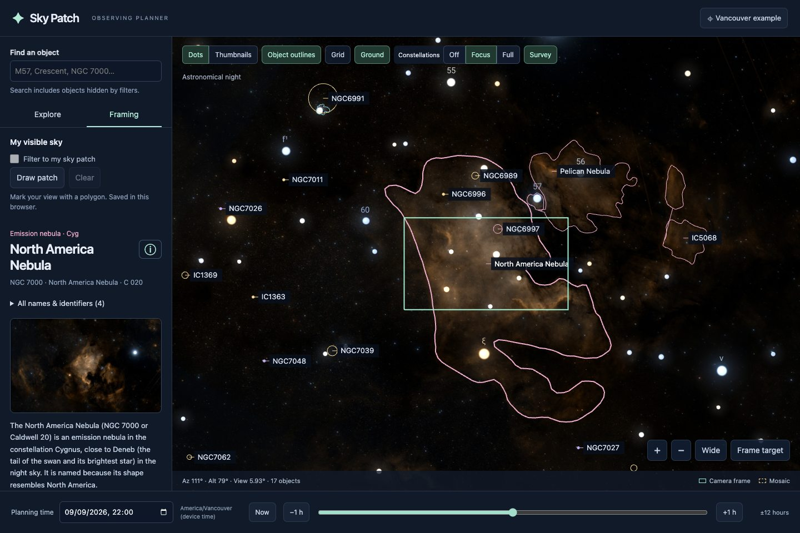

# Sky Patch

[Website & feature tour](https://claudeschneider.github.io/skypatch/) · [Open planner](https://claudeschneider.github.io/skypatch/app/) · [App status setup](https://claudeschneider.github.io/skypatch/app/?install=1)



A local-first astrophotography planner built around Stellarium Web Engine. Explore the sky, discover deep-sky targets and preview their true angular size in a DWARF Mini frame.

<!-- release:start -->
## Latest release · 0.8.0 — 2026-09-10
- Added altitude charts and above-horizon visibility windows in Info, including times inside your saved My Sky patch and a planning-time preview slider.

[Full changelog](CHANGELOG.md) · [Website changelog](https://claudeschneider.github.io/skypatch/changelog.html)
<!-- release:end -->

## Run locally

Requires Node.js 20.19+ (Node 22 recommended) and Python 3 for packaging downloadable source.

```sh
npm ci
npm run dev
```

Open http://127.0.0.1:5173. The initial location is a **coarse Vancouver example**, not a detected home address. Choose the location button to enter coordinates or explicitly request browser geolocation. Dates and times use the device's displayed timezone, even when the observing location is elsewhere.

## Features

- Full-sky Stellarium planetarium: drag or use arrow keys to pan, scroll or use +/− to zoom around the centre of the sky view (independent of cursor position), down to 0.08°.
- 12,160 OpenNGC deep-sky records with names, identifiers, coordinates, axes, position angle, type, constellation and photometry.
- An independent **Object outlines** toggle hides contours/ellipses while retaining dots, thumbnails and camera frames.
- Discoverable dots and labels at wide zoom; sourced outlines or angular ellipses at close zoom. The list provides access to all matching objects in the current view, including crowded dots.
- Telescope-scale survey thumbnails, plus DSS imagery on the main sky at close zoom. Thumbnails deliberately show a fixed single-frame angular width; some large objects extend outside them. The selected-object photo is a full-object reference. “Frame target” shows the object and camera footprint together on the map.
- Filters for type, above horizon, altitude, angular size, magnitude, surface brightness and frame fill. Search includes excluded objects and explains why they are excluded. Unknown measurements have an explicit inclusion option.
- A **2.14° × 1.20°** Mini preset for 1920 × 1080 output. Width/height are editable. Single frame, independent mosaic width/height up to 1.8×, and Alt-Az / EQ mount orientation.
- Settings saved in this browser only. No account, telescope connection or photo upload. A manual visible-sky polygon is supported.

## Ground and horizon

**Ground**, enabled by default beside Grid, covers all sky content below the geometric horizon. Turn it off to inspect the sky below your horizon. Its setting is saved in the browser and is independent of the grid and catalogue altitude filters. Search can still find a below-horizon target, but its sky position stays covered until you turn Ground off or change to a time when it is above the horizon. The camera frame remains visible to show when a composition extends into the ground. This is a flat astronomical horizon, not a local building/obstacle mask.

## Solar-system framing

Use the **Solar system** shortcuts in Explore, or search for Sun, Moon, Mercury, Venus, Mars, Jupiter, Saturn, Uranus or Neptune. Their positions and angular diameters update with the observing location and planning time. The details panel shows diameter in arcminutes/arcseconds, illuminated fraction where available, and approximately how many Mini output pixels span the disc.

The map shows **geometric disc footprints**, not photographic surfaces or simulated phase shading. Small unresolved bodies use a cross for discovery; its marker size is not the planet's diameter. The native engine's enlarged Moon and magnitude-based planetary glows are disabled. Saturn's size is its globe only; rings and oblateness are not simulated.

Solar-system visibility has its own switch, independent of deep-sky type/size/brightness filters. Horizon and altitude filters still apply. Searching can inspect a body below the horizon. A Sun selection reminds you to fit the telescope's correct solar filter before pointing it at the Sun.

## Framing interpretation

Camera footprints stay centred in the sky viewport, even without a selected object. Pan the sky to adjust the composition; changing equipment or mount mode does not recenter the target. Camera footprints use a spherical TAN footprint projected into the same stereographic view as the planetarium. They are not fixed screen rectangles. Alt-Az aligns frame-up toward the local zenith, keeping the rectangle level in the horizon-oriented map. EQ aligns toward the celestial pole of date, so the rectangle rotates relative to the horizon as you pan or change time. These are ideal alignment models with zero fixed sensor roll, not calibrated Mini output orientation. At an alignment pole, orientation is singular and the app labels the fallback. The selected-object survey photo remains a north-up reference; compose using the camera frame on the main map.

“Frame target” fits the full catalogue contour and active mosaic with padding. The native mosaic preset covers up to **3.852° × 2.160° overall**, not 1.8 extra frames on each edge. Photographic brightness/detail is not a prediction of Mini performance. Angular extent and approximately sampled pixels are not a promise of resolved structure.

Nebula boundaries depend on the source and brightness level. Where OpenNGC has a contour, it is shown; otherwise an ellipse uses the available axes/position angle. Missing minor axes use a labelled circular approximation; missing position angles are labelled unknown. Surface brightness is the sourced mean **B-band mag/arcsec²** field, not a invented nebula score. Magnitudes prefer V and otherwise show B explicitly.

## Network and privacy

The app, engine, bright-star data and catalogue are served locally. DSS tiles and cutouts stream directly from CDS Strasbourg, so images need internet access and may load slowly or fail. A failed cutout displays an explicit fallback; outlines and camera geometry remain usable. The bundled bright-star sample is limited to roughly magnitude 7; deeper photographic stars come from DSS at close zoom.

The app does not transmit observing coordinates to its own server. CDS receives the requested celestial image coordinates and the normal network request information. No analytics are included. Browser geolocation runs only after clicking its button.

## Tests and static build

```sh
npm test
npm run test:browser   # requires installed Google Chrome; separate automated profile
npm run build
npm run preview
```

`dist/` is a static site with relative URLs, suitable for GitHub Pages (including a repository subpath). Serve over HTTP rather than opening index.html as a file. Build includes a downloadable source archive and notices. No site has been publicly deployed and no GitHub repository has been created by this implementation.

See [docs/DEPENDENCIES.md](docs/DEPENDENCIES.md) for pinned engine/data provenance and reproduction, [docs/VERIFICATION.md](docs/VERIFICATION.md) for checks, and [docs/PLAN.md](docs/PLAN.md) for the longer roadmap.

## Contributing

Keep astronomy, filtering and rendering separate. Preserve data provenance and unknown values. Add geometric regression cases when changing projections or framing, and browser checks when changing the planning workflow. Run both suites and the build before submitting a change. Never commit personal location settings or scope photos.

Manual visible-sky polygons are phase two. Boundary generation from scope photos is phase three. A richer catalogue table and observing-window tools can be prioritized independently.

## Licence

Application: AGPL-3.0-only. Stellarium Web Engine: AGPL v3. OpenNGC catalogue and outlines: CC BY-SA 4.0, with their own notices and source lineage. Astronomy Engine: MIT. Roboto: Apache 2.0. DSS imagery retains its survey terms and credits; no ownership is claimed. See the in-app Sources & credits page and `public/licenses/`.

### Object reference information
The ⓘ menu beside a selected object's name opens a Wikipedia overview in a reader dialog, with the full article available in a new tab. Deep-sky objects also link to SIMBAD measurements, identifiers and bibliography, and an ESA/Hubble image search. Search coverage varies by object. Canonical catalogue identifiers resolve Wikipedia redirects; missing or ambiguous articles are shown explicitly. Wikipedia is requested only when the reader is opened, without credentials, and its text is credited under CC BY-SA 4.0. Other sources open externally.

Each filter (object type, altitude including horizon, angular size, magnitude, surface brightness and frame fill) can be disabled independently. “All filters” pauses filtering and restores the individual switches when re-enabled; values and switches persist in this browser. Ground and the solar-system layer remain separate display controls.

### Visible sky patch
Pan to your balcony view, choose **Draw patch**, then click or tap corners and **Finish**. **Undo** removes the last corner; **Cancel** keeps the previous saved boundary. The polygon follows great-circle edges in local altitude/azimuth coordinates, remaining fixed to your surroundings as planning time changes. Concave outlines and north-crossing patches are supported; crossed edges and patches spanning too much sky are rejected. The filter uses object centres, not whole-object or camera-frame containment.

**Filter to my sky patch** enables or pauses the saved polygon. **All filters** also pauses it. Ground stays independent. One patch is stored in this browser and applies to the chosen observing location; redraw it when changing observing sites. On phones, drawing closes the sidebar to expose the map.

### Mobile and offline installation
On phones, **Plan** opens a bottom drawer. Swipe its header up to expand, down to collapse/dismiss, or tap it to close. **View** contains the map layers. Drag with one finger to pan; pinch to zoom about the centre. Selecting an object opens its details in the drawer. These interactions have been tested with Chrome touch emulation; physical iOS/Android checks remain advisable.

The production build is an installable PWA. Open **App status** near the bottom of the planning panel. The first online visit automatically saves the core (about 9.6 MB), including the engine, bundled bright stars and deep-sky catalogue. Wait for **Core ready offline** before disconnecting. Install using the provided button where available, or Safari's Share → Add to Home Screen. Installation and downloading are separate: the browser website can also work offline after the core is saved. HTTPS is required except on localhost.

The optional **Download survey overview** saves DSS imagery across the whole sky through HiPS order 3 (roughly one arcminute per pixel). A verified download used 42.8 MB; the hard limit is 80 MB. Progress is shown; Cancel keeps completed tiles so Download can resume. Remove imagery preserves the core and your settings. Online survey browsing does not automatically grow this persistent cache. Fine survey detail, object-preview cutouts and Wikipedia are not included in the offline pack. Browsers may evict storage: check offline readiness before a session. Open **App status** to see the installed build and select **Check for updates**. When a release is ready, choose **Update now** in the notification or offline panel; **Later** dismisses the notification. Updating reloads the app and preserves saved preferences and downloaded survey imagery. Finish or cancel an imagery download before updating. Updates require an internet connection and a successful website deployment; a repository change alone does not publish a release.

For local PWA testing: `npm run build`, then `npm run preview -- --port 4173`, and visit http://127.0.0.1:4173/. The development server deliberately does not register a service worker, to avoid cached releases hiding code changes. Browser settings belong to each origin, so the preview has separate settings from port 5173. Run `npm run test:pwa` against a fresh production build for offline checks.

## Public website and contributions

The landing page lives in `landing/`; the planner source lives in `src/`. `npm run build` creates `site/`, with the landing page at the root and the complete planner/PWA under `app/`. The service worker is scoped to the app, so it never replaces the landing page. Marketing screenshots do not enlarge the offline core.

GitHub Actions builds and publishes `site/` to GitHub Pages on pushes to `main`. No backend, account database or API keys are needed. For a complete local website preview, run `python3 -m http.server 4180 --directory site` after building.

See [the user guide](docs/USER-GUIDE.md) for first use, mobile controls and offline installation. Contributions and bug reports are welcome. Include your browser/device, steps to reproduce and a screenshot when helpful. Run `npm test`, `npm run test:browser`, and `npm run build && npm run test:pwa` before proposing a change. Do not include private location settings, credentials or downloaded survey caches in contributions.

## Expanded catalogue and equipment controls
Object types are a checkbox multi-select with All/None controls. Multiple chosen types form a union. The Object type switch and All filters pause the selection without losing it. Constellations now have Off, Focus (near the pointing direction), and Full (all in-view constellations) modes.

Select an equipment preset in Framing: DWARF II/3/Mini/Draco, Seestar S30/S30 Pro/S50/S50 Pro, Vespera Classic/Passengers/II/Pro/Pro II, or a full-frame DSLR at nine focal lengths from 24–400 mm. See [preset sources and assumptions](docs/EQUIPMENT-PRESETS.md).

Object details show common names and all available catalogue identifiers. Offline descriptions comprise 207 attributed Wikipedia introductions plus a catalogue-derived overview for every other DSO. These are clearly labelled; the overview is not a claim of independently researched history. Regenerate the Wikipedia snapshot explicitly with `python3 scripts/build-descriptions.py` (network required); normal builds simply bundle the checked-in data.

The top-bar status button shows **Install**, **App** (installed), or **Offline**. Open it for connection and core-cache status, installation guidance, downloads, the installed version, offline changelog and update checks. In **My Sky**, use **Edit points** and drag any corner (or focus it and use arrow keys), then **Save changes**. **Cancel** keeps the original. **Redraw from scratch** starts a replacement without deleting the saved patch until you finish. **All filters** pauses catalogue filters only; the patch has its own switch.
